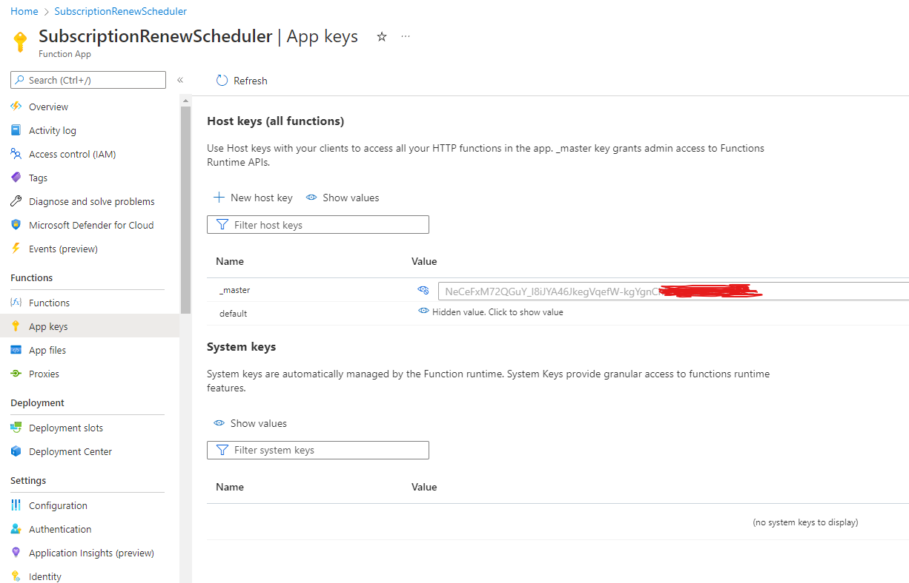
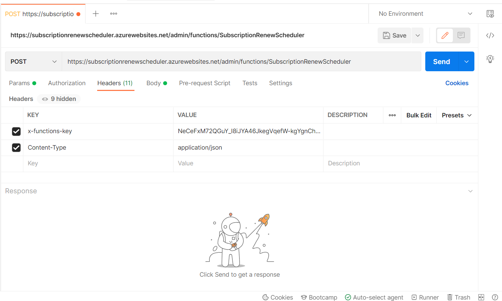
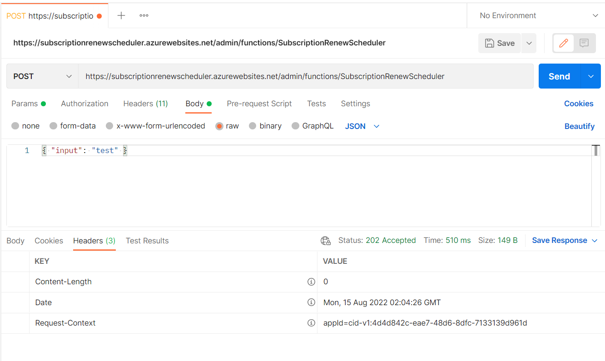

# SubscriptionRenewScheduler

## 本機執行

啟動 Demo App

```
> cd DemoApp/DemoApp.MvcApp
> dotnet run
```

啟動 azurite:

```
> azurite -l azurite_workspace
```

新增本機的設定檔:

```
> cd FunctionApps/FunctionApps.SubscriptionRenewScheduler
> vim local.settings.json
```

加入以下內容:

```json
{
    "IsEncrypted": false,
    "Values": {
        "AzureWebJobsStorage": "UseDevelopmentStorage=true",
        "FUNCTIONS_WORKER_RUNTIME": "dotnet",
        "DemoUrl": "https://localhost:7051/function/renew"
    }
}
```

啟動 Function App:

```
> cd FunctionApps/FunctionApps.SubscriptionRenewScheduler
> func start --csharp
```

## 遠端執行

請先把 DemoApp 佈署到雲端，以我的例子是佈署到 Heroku 的 jacklin-scheduler.herokuapp.com。

在 Azure 中創建 Resource Group、Storage Account、Function App

```
> az login
> az group create --name schedulers --location japanwest
> az storage account create --name jacklin --location japanwest --resource-group schedulers --sku Standard_LRS
> az functionapp create --resource-group schedulers --consumption-plan-location japanwest --runtime dotnet --functions-version 4 --name SubscriptionRenewScheduler --storage-account jacklin
```

從本機把 Function App 佈署到 Azure:

```
> func azure functionapp publish SubscriptionRenewScheduler
```

查看 Log:

```
> func azure functionapp logstream SubscriptionRenewScheduler
```


## 手動觸發 Timer-Triggered Function

Timer-Triggered Function 預設手動觸發的網址為:

```
https://<FunctionAppName>.azurewebsites.net/admin/functions/<FunctionName>
```

可以透過 Postman 來傳送手動觸發的請求，首先在 Azure 找到 `Home > SubscriptionRenewScheduler`，在左側找到 `Functions > App keys`，查看 `_master` 金鑰:



然後在 Postman 中選擇 `POST`，輸入以下網址。接下來切換到 `Headers` 填上 `x-functions-key` 和 `Content-Type`:



接下來切換到 `Body` 選擇 `raw`，填上 `{ "input": "test" }`。最後點擊 `Send` 送出請求，即可手動觸發 Function:



若成功觸發，會收到 Status Code 202。
